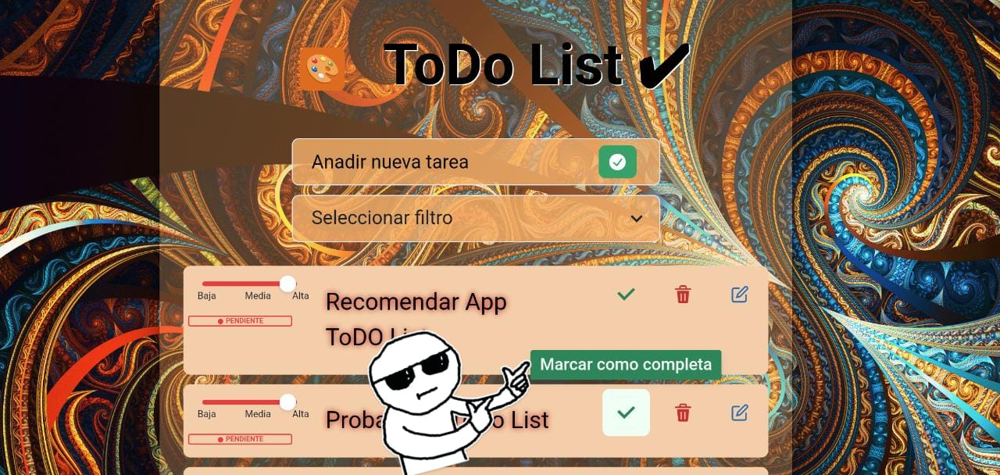
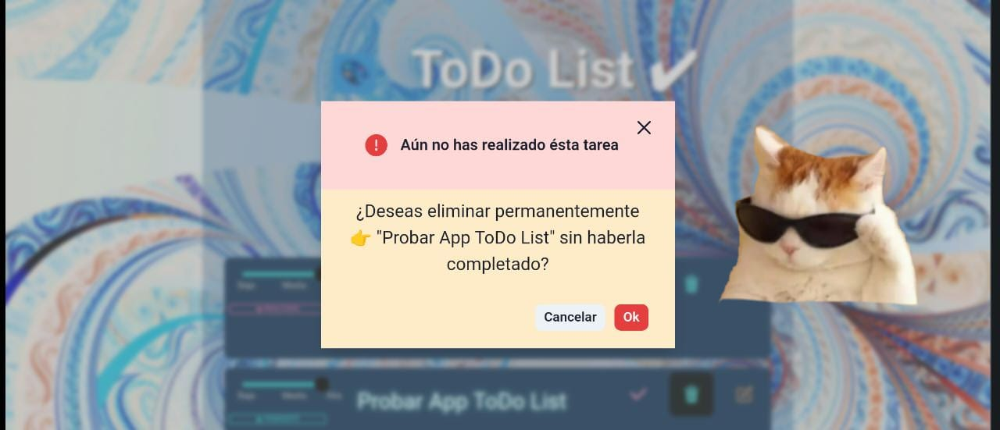
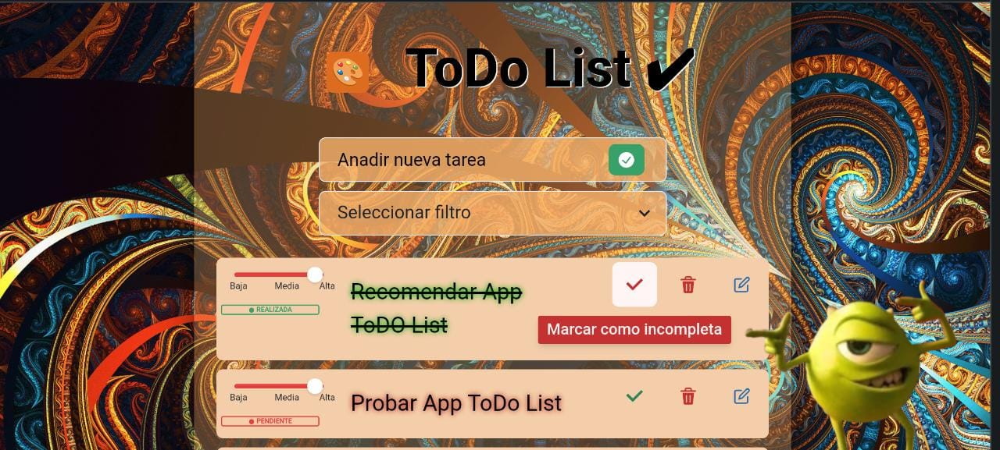
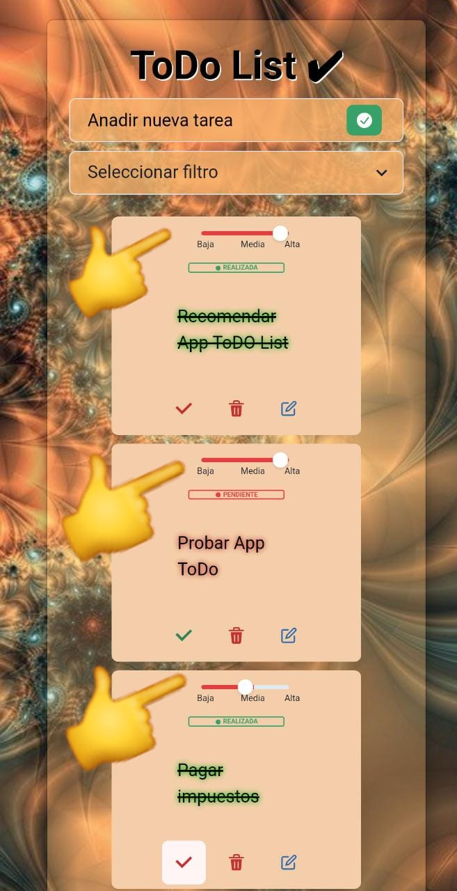
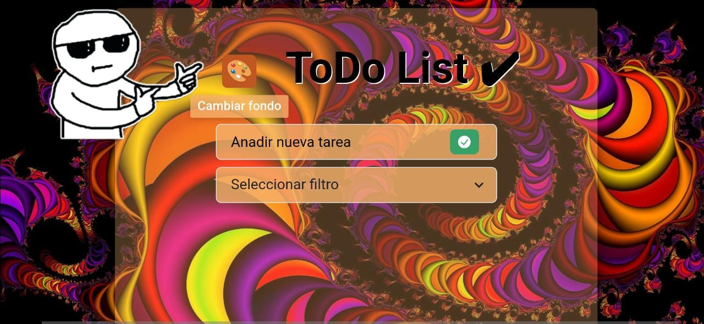
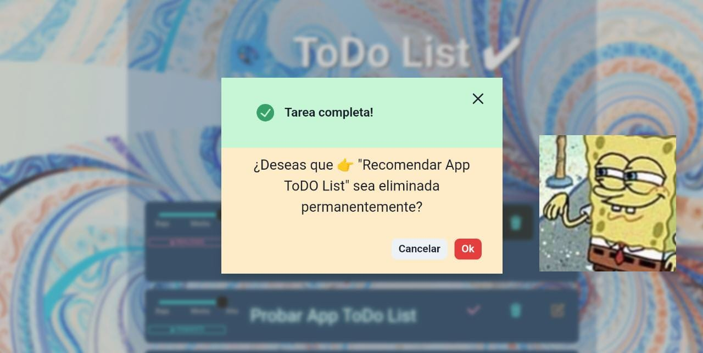
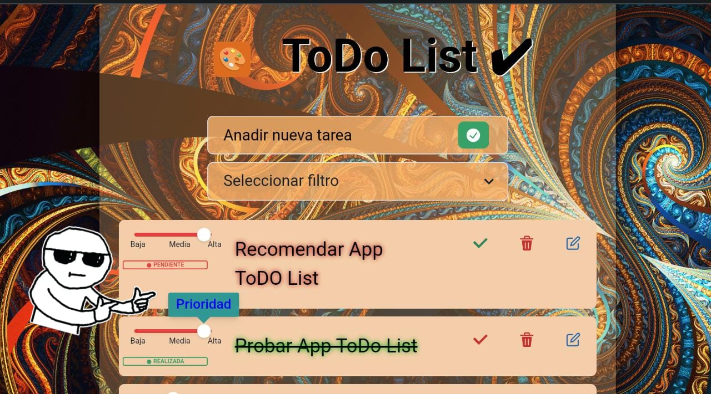
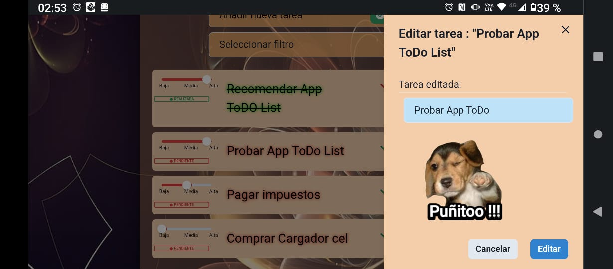

# ToDo List ✔

## Proyecto final Modulo V ADA ITW "React"

### Intro
---
- Este `proyecto` fue creado en base al modelo que nos dejó `ADA`, para poner a prueba los `conocimientos adquiridos` hasta este momento.
Es un diseño totalmente responsive para ser utilizado desde cualquier dispositivo. 

- Realizado con: 
- `Vite` 
- `React`
- `Chakra UI`

### Descripción
---
- Es una App que te ofrece:
- Generar `Una lista de tareas`, donde podrás especificar:
    - `Tarea`
    - `Estado -Realizada/Pendiente`
    - `Prioridad`
-  `Crear`, `Editar`, `Filtrar` y `Eliminar` las `Tareas generadas`.
- Cambiar los `filtros` y renderizar una vista de tus tareas según su `Estado`.
---
## Para poder utlizar la App debes seguir los pasos detallados a continuación:
1. Clonar este repositorio.
2. Instalar las dependencias del proyecto mediante el comando npm install.
3. Ejecutar el proyecto mediante el comando npm run dev.
4. Si desea compartir en la red local mediante un servidor utilice el comando npm run dev -- --host y comparta el link. *Los dispositivos deben estar conectados en la misma red Wifi.

 #### NOTA DE EXTRAS 
 ---
  Se agregan
- Tooltips para cada funcionalidad.
- Badge para marcar tarea segun su estado.
- Slider para marcar prioridad.
- Renderizado según prioridad.
- Modal con Alert de advertencia para confirmar eliminación con mensaje y texto condicionado al estado de tarea realizada/pendiente.
- Drawer para editar tarea 
 - Renderizando estado previo y editado.
 - Validando que el campo editado no sea menor a 3 carácteres.
 - Mensaje de advertencia y botón desabilitado si no es válido.
- Boton para cambiar fondo de imagenes aleatorio.
- Logo.
- Favicon.
- Etiquetas meta.
- Google verification.
  - Git branch: 
  - Se usa rama Develop para desarrollo de app.
  - Una vez llegado al objetivo básico se crea una nueva rama Feature.
  - se crea una neuva rama para cada funcionalidad o corrección. 
 
 
##### Te dejo algunas Screenshots de mi App.
.
.
.
.
.
.
.
.
.
---

### Ahora te invito a probar mi App para que no olvides realizar tareas importantes! puedes hacerlo según los pasos detallados más arriba.

Te dejo el link para que puedas empezar ahora mismo a ordenar tus pendientes!

- 👉https://todo-list-react-cintyy73.vercel.app

### ESPERO QUE SEA ÚTIL Y TE HAGA MAS FÁCIL EL DÍA A DÍA!!   